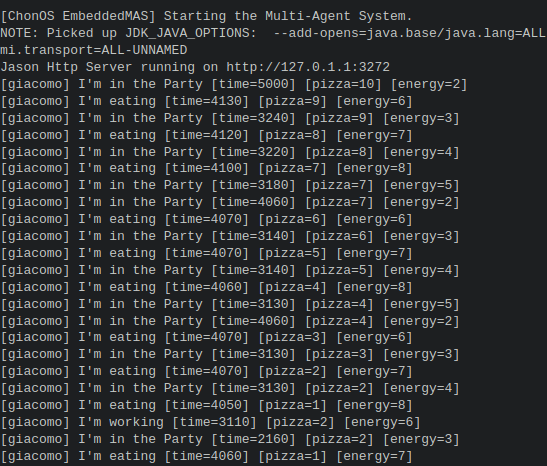

# Giacamo Life - SingleAgent System Exercise

Giacomo is an agent whose only goal is to party; he eats pizza and eventually works to give more pizza.

Giacomo's health is very fragile, as:
+ If he has energy equal to or less than 1, he dies from starvation;
+ If his energy level exceeds 12, he dies from obesity;
+ If he doesn't dance for 5000 milliseconds, he dies of sadness.

Logic of Giacamo's life:
+ Each pizza he eats increases his energy bar in 4 units.
+ Every time he goes clubbing, his energy decreases by 3 units.
+ Initially, Giacomo's energy is 5 units;
+ Initially, Giacomo has a stock of 10 pizzas;
+ Each time he works, his energy decreases by 2 units, and he gains 1 pizza unit.
+ Giacamo can only store 20 pizzas in his house.

## Expected output
Below is an image with the expected output.

## Solution

The solution of this exercise is available at https://docs.google.com/document/d/1M--onE4BJfkFaMl-RSC6l7olNMdVHt1sLxl-DiDdrWc/edit?usp=sharing

Get the solution and change the content of file [giacomo.asl](agt/giacomo.asl)