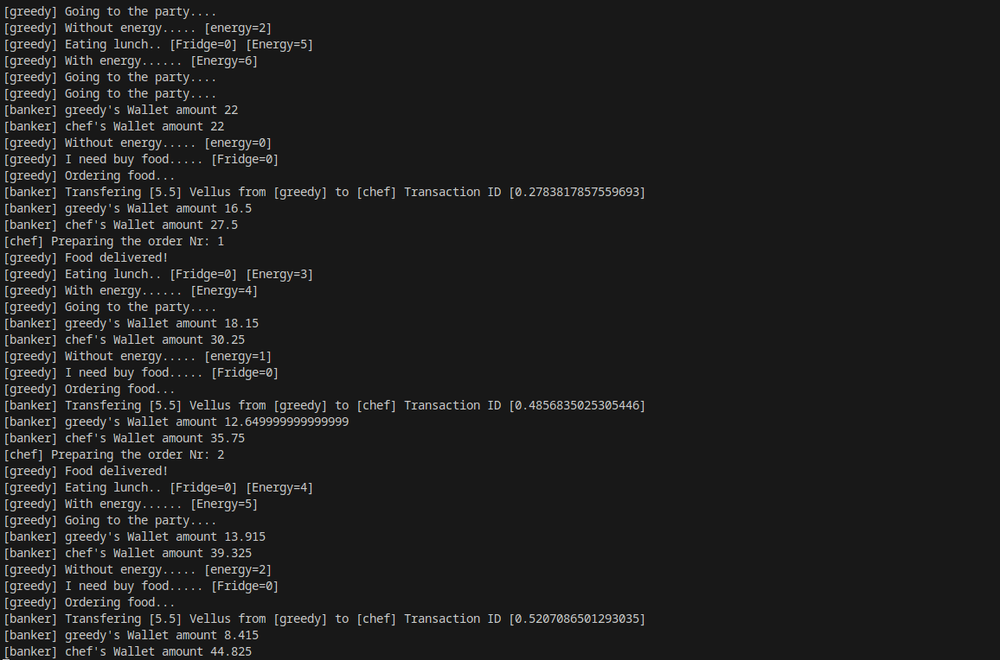

# Banker-chef-greedy - MultiAgent System Exercise

In this exercise, you should implement a Multi-Agent System composed of a banker, a chef, and a greedy considering the description below:

+ Banker agent
     + manages the balance of the agents' wallet.
     + transfers balances between agents' wallets and informs the transfer code.
     + the balance in the wallets render 10% every 5000 milliseconds.

+ Greedy agent
     + has the goal of going to the party (each time, three units of his energy are spent).
     + when he has no energy, he must eat (each pizza increases the energy by 4  units).
     + when there is no pizza in the fridge stock, he buys pizza from the chef agent.
     + when he doesn't have funds in your account, he hibernates until the money has been rendered.

+ Chef Agent
     + charges 5.5 vellus for a pizza;
     + before starting pizza production, he checks with the banker if the transfer code is valid and if the payment transfer code has not already been used.

Initially, each agent has 20 vellus in their wallet. The Greedy has 5 units of energy and 1 pizza in the fridge. 

## Expected output
Below is an image with the expected output.

## Solution

The solution of this exercise is available at ...

+ Get the solution and change the content of file [banker.asl](agt/banker.asl)
+ Get the solution and change the content of file [chef.asl](agt/chef.asl)
+ Get the solution and change the content of file [greedy.asl](agt/greedy.asl)