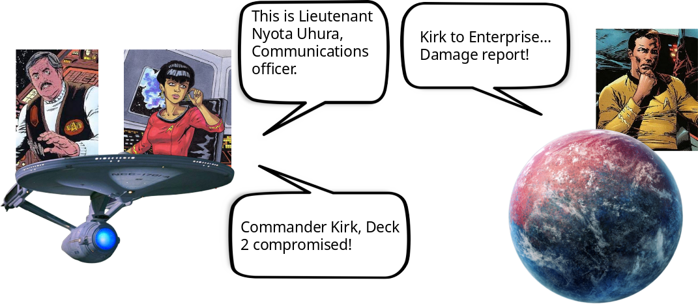
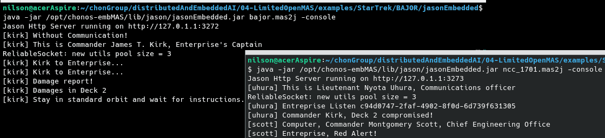

# Star Trek - Communicator Agents

In this example, there is two Multi-Agent Systems andoriaMAS and enterpriseMAS described below:

 

## Description
### Bajor Multi-Agent System
+ [Kirk](BAJOR/agts/kirk.asl) 
    
    to do description...

### Enterprise Multi-Agent System
+ [Uhura](NCC-1701/agts/uhura.asl)

    to do description...

+ [Scott](NCC-1701/agts/scott.asl)

    to do description...
     
## Output
Below is an image with the output.

 

