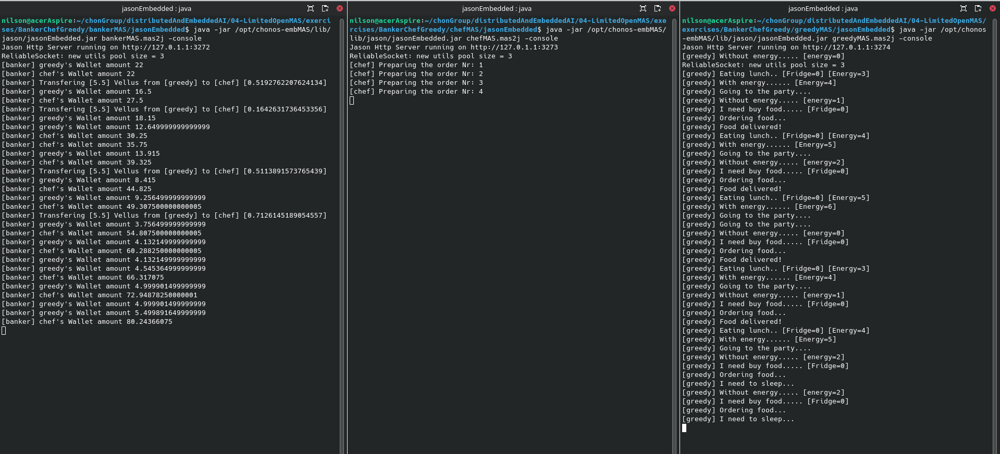

# Banker-chef-greedy - Limited Open MultiAgent System Exercise

In this exercise, you should implement three Multi-Agent Systems composed of a banker, a chef, and a greedy considering the description below:

+ BankerMAS agent
     + manages the balance of the agents' wallet.
     + transfers balances between agents' wallets and informs the transfer code.
     + the balance in the wallets render 10% every 5000 milliseconds.

+ GreedyMAS agent
     + has the goal of going to the party (each time, three units of his energy are spent).
     + when he has no energy, he must eat (each pizza increases the energy by 4  units).
     + when there is no pizza in the fridge stock, he buys pizza from the chef agent.
     + when he doesn't have funds in your account, he hibernates until the money has been rendered.

+ ChefMAS Agent
     + charges 5.5 vellus for a pizza;

Initially, each agent has 20 vellus in their wallet. The Greedy has 5 units of energy and 1 pizza in the fridge. 

## Expected output
Below is an image with the expected output.

## Solution

The solution of this exercise is available at https://drive.google.com/drive/folders/1BC29D3wwRR6mGrJ2cm72kF_-fAMup6xx?usp=drive_link 

+ Get the solution and change the content of file [banker.asl](bankerMAS/agts/banker.asl)
+ Get the solution and change the content of file [chef.asl](chefMAS/agts/chef.asl)
+ Get the solution and change the content of file [greedy.asl](greedyMAS/agts/greedy.asl)