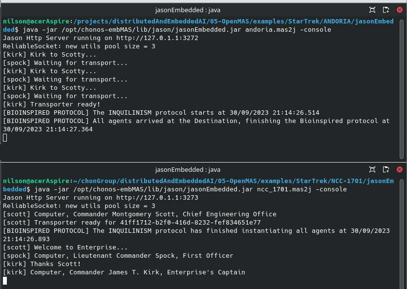

# Star Trek - Mobile Agents

In this example, there is two Multi-Agent Systems andoriaMAS and enterpriseMAS described below:

## Description
### Andoria Multi-Agent System
+ [Kirk](ANDORIA/agts/kirk.asl) 
    
    to do description...

+ [Spock](ANDORIA/agts/kirk.asl) 
    
    to do description...

### Enterprise Multi-Agent System
+ [Scott](NCC-1701/agts/scott.asl)

    to do description...
     
## Output
Below is an image with the output.

 

