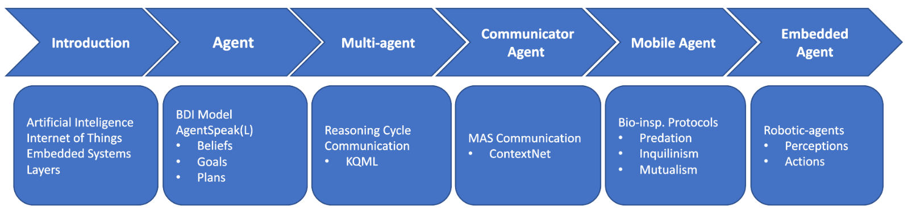

# Introduction to Distributed and Embedded Artificial Inteligence

Several application domains have used the Internet of Things (IoT) paradigm by using devices that perceive the real-world environment and produce raw data to be processed in the cloud. On the other hand, pervasive computing has used the Artificial Intelligence (AI) paradigm to promote information extraction and decision-making at the edge computing layer.  Thus, the intersection between the paradigms of AI and IoT conceived a new area of possibilities called Artificial Intelligence of Things (AIoT). 

Considering this scenario, we introduce the development of cognitive, autonomous, and collaborative IoT devices that are capable of perceiving, deciding, and acting in the real world. For this, we are using an embedded multi-agent systems approach that allows the implementation of mental attitudes of beliefs, desires, and intentions into physical devices. 

In this course, students will: 
+ to understand how to use a specialized version of the Jason Framework for embedded systems; 

+ to use an integrated development environment to program the firmware and reasoning layers of cognitive devices; 

+ to know about a specific-purpose operating system for embedded multi-agent systems; and finally, 

+ to access an IoT network to allow communication between autonomous agents and cognitive hardware.

## Content

+ Introduction
+ [Single-agent System](02-Single-agentSystem)
+ [Multi-agent System](03-Multi-agentSystem)
+ [Communicator Agent](04-LimitedOpenMAS)
+ Mobile Agent
+ Embedded Agent

## Copyright
 This course is licensed under a <a rel="license" href="http://creativecommons.org/licenses/by/4.0/">Creative Commons Attribution 4.0 International License</a>. The licensor cannot revoke these freedoms as long as you follow the license terms:

* __Attribution__ — You must give __appropriate credit__ like below:

LAZARIN, Nilson Mori; PANTOJA, Carlos Eduardo; VITERBO, José. Towards a Toolkit for Teaching AI Supported by Robotic-agents: Proposal and First Impressions. _In:_ WORKSHOP SOBRE EDUCAÇÃO EM COMPUTAÇÃO (WEI), 31. , 2023, João Pessoa/PB. Anais [...]. Porto Alegre: Sociedade Brasileira de Computação, 2023 . p. 20-29. ISSN 2595-6175. DOI: https://doi.org/10.5753/wei.2023.229753. 
